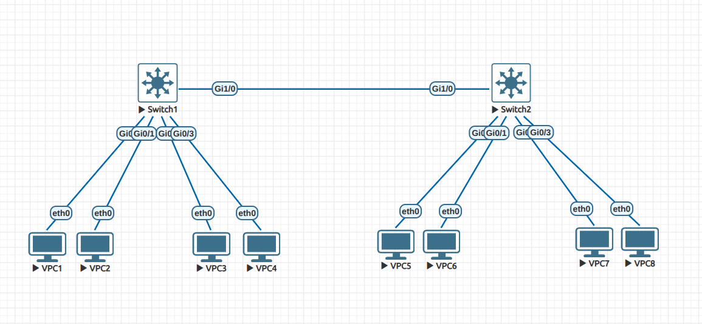

# Lab 02 - VLAN Trunks

## Objective
- Practice creating VLANs on two switches.  
- Assign access ports for PCs in different VLANs.  
- Configure a trunk link between two switches.  
- Verify VLAN communication across switches.  

## Topology
- 2 Switches (SW1, SW2)  
- 8 PCs (VPC1–VPC8)  
- VLANs: 10, 20  
- Each VLAN spans both switches  

## Configuration Summary

### VLAN to VPC Mapping

| VLAN | Subnet           | VPCs Assigned                            |
|------|------------------|-------------------------------------------|
| 10   | 192.168.10.0/24 | VPC1 (192.168.10.11), VPC2 (192.168.10.12), VPC5 (192.168.10.13), VPC6 (192.168.10.14) |
| 20   | 192.168.20.0/24 | VPC3 (192.168.20.11), VPC4 (192.168.20.12), VPC7 (192.168.20.13), VPC8 (192.168.20.14) |

- SW1:  
  - Gi0/0–1 → VLAN 10 (VPC1, VPC2)  
  - Gi0/2–3 → VLAN 20 (VPC3, VPC4)  

- SW2:  
  - Gi0/0–1 → VLAN 10 (VPC5, VPC6)  
  - Gi0/2–3 → VLAN 20 (VPC7, VPC8)  

- Trunk link:  
  - SW1 Gi1/0 ↔ SW2 Gi1/0  
  - Configured as `switchport mode trunk` with `dot1q` encapsulation  

(See `configs/` for full device configs)

## Verification
- Commands used:  
  - `show vlan brief` → confirmed VLAN creation and access port assignments  
  - `show interfaces trunk` → verified trunk status and allowed VLANs  
  - `ping` tests:  
    - VPC1 ↔ VPC2 (✅ worked, same VLAN on same switch)  
    - VPC3 ↔ VPC4 (✅ worked, same VLAN on same switch)  
    - VPC1 ↔ VPC5 (✅ worked after trunk config, same VLAN across switches)  
    - VPC3 ↔ VPC7 (✅ worked after trunk config, same VLAN across switches)  

## Lessons Learned
- Access ports only allow connectivity within the local switch VLAN.  
- A trunk is required for VLAN traffic to cross between switches.  
- `show interfaces trunk` is essential to confirm which VLANs are being carried.  
- VLAN-to-subnet consistency is key: mismatched VLANs or IP ranges break communication.  
