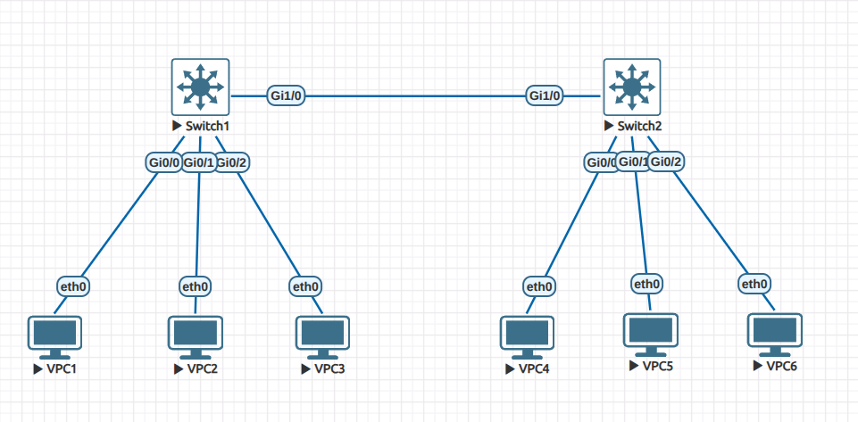
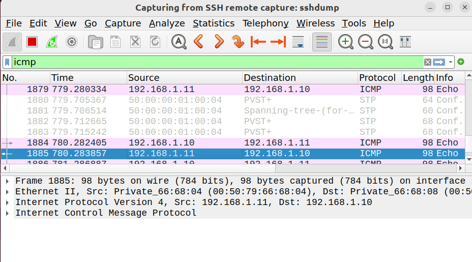
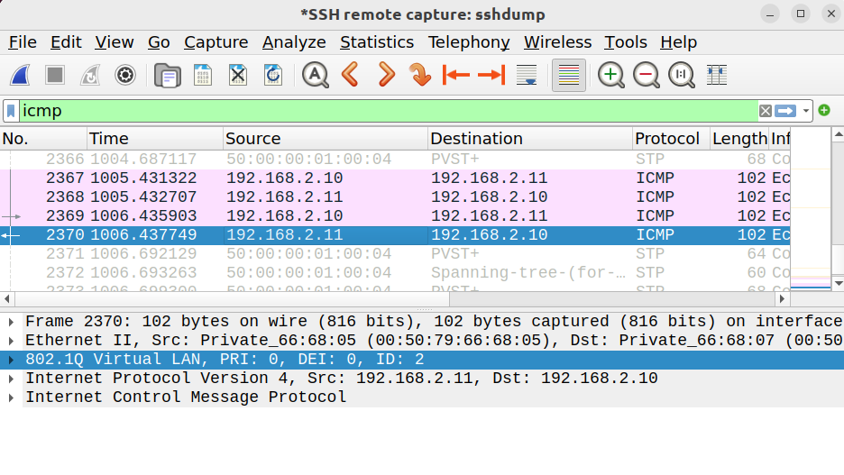
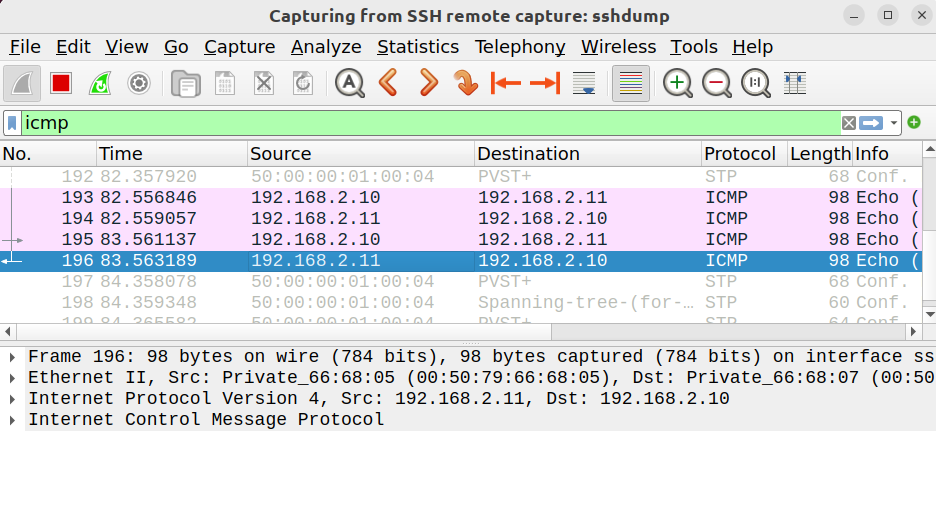
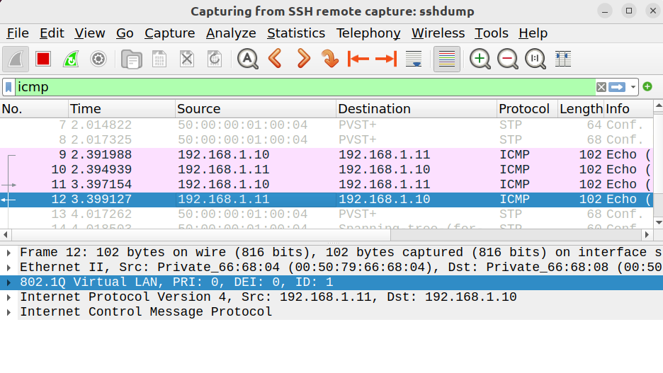

# Lab 03 - Native VLAN

## Objective
- Understand the concept of the native VLAN on a trunk.  
- Verify which VLAN is untagged by default.  
- Observe VLAN tags using Wireshark.  
- Change the native VLAN and confirm behavior.  

## Topology
- 2 Switches (SW1, SW2)  
- 6 PCs (3 on each switch)  
- VLANs: 1, 2, 3  
- Trunk link between SW1 Gi1/0 ↔ SW2 Gi1/0  

## Configuration Summary

### VLAN to VPC Mapping

| VLAN | Subnet         | SW1 PCs                  | SW2 PCs                  |
|------|----------------|--------------------------|--------------------------|
| 1    | 192.168.1.0/24 | VPC1 (192.168.1.10)      | VPC1 (192.168.1.11)      |
| 2    | 192.168.2.0/24 | VPC2 (192.168.2.10)      | VPC2 (192.168.2.11)      |
| 3    | 192.168.3.0/24 | VPC3 (192.168.3.10)      | VPC3 (192.168.3.11)      |

### Switch Configuration
- SW1 & SW2:  
  - VLANs 1, 2, 3 created.  
  - Access ports:  
    - Gi0/0 → VLAN 1  
    - Gi0/1 → VLAN 2  
    - Gi0/2 → VLAN 3  
  - Trunk:  
    - Gi1/0 set as `switchport mode trunk` with `dot1q` encapsulation.  
    - Default native VLAN = 1.  

(See `configs/` for full device configs)

## Verification

### Key Commands
- `show vlan brief` → confirmed VLAN creation and port assignments.  
- `show interfaces trunk` → verified trunk is up, VLANs allowed, native VLAN = 1.  

### Wireshark Results
- **With default native VLAN (1):**  
  - Ping from VPC1 → VPC1 (VLAN 1) → *untagged*.  
      
  - Ping from VPC2 → VPC2 (VLAN 2) → *tagged with VLAN 2*.  
      
  - Ping from VPC3 → VPC3 (VLAN 3) → *tagged with VLAN 3*.  

- **After changing native VLAN to 2:**  
  - VLAN 1 traffic is now *tagged*.  
      
  - VLAN 2 traffic becomes *untagged*.  
      
  - VLAN 3 remains tagged as before.  

## Lessons Learned
- By default, VLAN 1 is the native VLAN on Cisco switches.  
- Native VLAN traffic is *not tagged* on the trunk.  
- Changing the native VLAN shifts which VLAN is untagged.  
