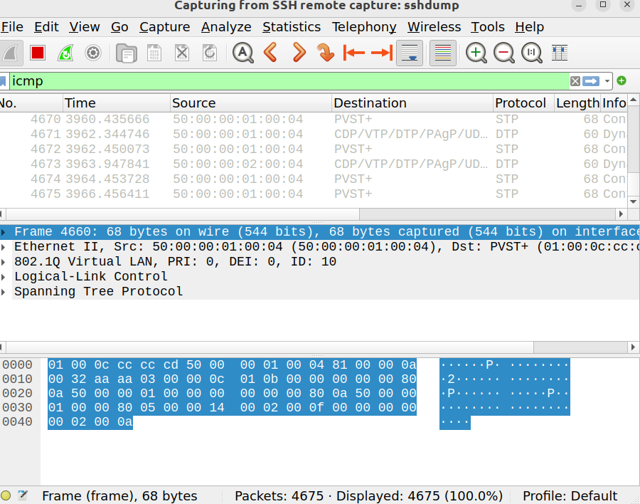

# Lab 04 - Allowed VLANs on Trunks

## Objective
- Understand how the **allowed VLAN list** controls traffic on trunks.  
- Observe the effect of unnecessary VLANs consuming bandwidth.  
- Configure allowed VLANs to restrict trunk traffic.  
- Verify changes using Wireshark captures.  

## Topology
- 2 Switches (SW1, SW2)  
- 8 PCs total  
- VLANs: 10, 20, 30  
- Trunk link between SW1 Gi1/0 ↔ SW2 Gi1/0  


## Configuration Summary

### VLAN to VPC Mapping (initial)

| VLAN | Subnet           | SW1 PCs                       | SW2 PCs                       |
|------|------------------|-------------------------------|-------------------------------|
| 10   | 192.168.10.0/24 | VPC1 (192.168.10.10), VPC2 (192.168.10.11) | VPC5 (192.168.10.12), VPC6 (192.168.10.13) |
| 20   | 192.168.20.0/24 | VPC3 (192.168.20.10), VPC4 (192.168.20.11) | — |
| 30   | 192.168.30.0/24 | — | VPC7 (192.168.30.10), VPC8 (192.168.30.11) |

- VLANs 10, 20, 30 created on both switches.  
- Gi0/x ports assigned as access ports.  
- Gi1/0 on both switches configured as trunk:  
  ```plaintext
  switchport trunk encapsulation dot1q
  switchport mode trunk
(See configs/ for full device configs)

## Verification

### Step 1: Default Behavior

show vlan brief → VLANs 10, 20, 30 created and assigned.

show interfaces trunk → trunk up, native VLAN = 1, all VLANs allowed by default.

Pings:

✅ VPC1 ↔ VPC2, VPC1 ↔ VPC5 (same VLAN 10)

✅ VPC3 ↔ VPC4 (same VLAN 20)

✅ VPC7 ↔ VPC8 (same VLAN 30)

❌ No connectivity between different VLANs (expected).

Wireshark: ARP broadcast from VPC3 forwarded unnecessarily across the trunk.

  

### Step 2: Restricting Allowed VLANs

Config on both trunks:

switchport trunk allowed vlan 10
show interfaces trunk → only VLAN 10 allowed.

Pings:

✅ VPC1 ↔ VPC5 still worked.

❌ ARP from VPC3 no longer crossed the trunk (confirmed in Wireshark).

  

### Step 3: Adding VLAN 20

VPC7 → 192.168.20.12, VPC8 → 192.168.20.13.

Config on both trunks:

switchport trunk allowed vlan 10,20
Pings:

✅ VPC3 ↔ VPC4 ↔ VPC7 ↔ VPC8 (all VLAN 20 hosts reachable).

Wireshark: ping from VPC3 → VPC7 showed a frame tagged with VLAN 20.

  

## Lessons Learned

By default, trunks forward traffic for all VLANs.

Use the allowed VLAN list to limit traffic and prevent unnecessary broadcasts.

Wireshark captures are an excellent way to validate VLAN tagging behavior.

Keeping trunk VLANs limited improves both efficiency and security.