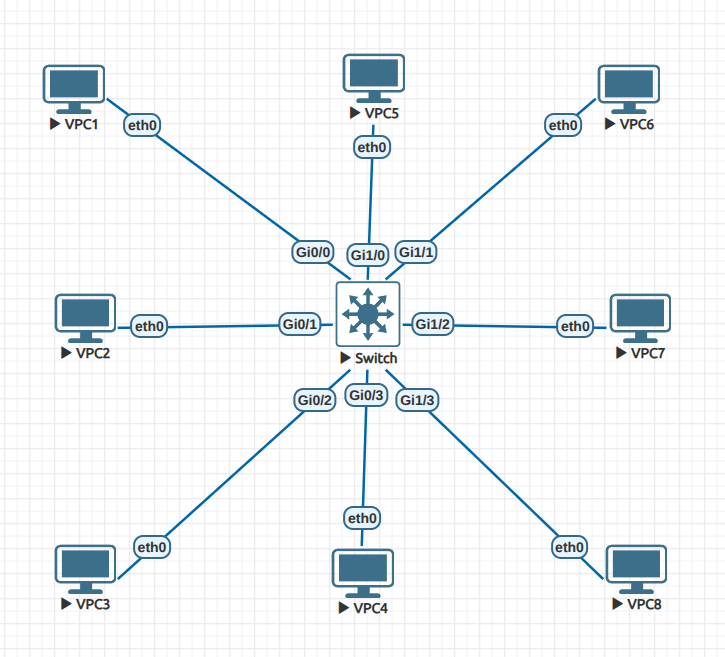

# Lab 05 - Layer 2 MAC Address Diagnostics

## Objective

- Explore how MAC addresses are learned dynamically on a switch.  
- Practice adding static MAC addresses.  
- Understand how to display, filter, and clear MAC address entries.  

## Topology

- 1 Switch  
- 8 PCs (VPC1-VPC8)  

| PC   | IP Address     | MAC Address           | Switch Interface |
|------|---------------|---------------------|-----------------|
| VPC1 | 192.168.1.1   | 00:50:79:66:68:09   | G0/0            |
| VPC2 | 192.168.1.2   | 00:50:79:66:68:02   | G0/1            |
| VPC3 | 192.168.1.3   | 00:50:79:66:68:03   | G0/2            |
| VPC4 | 192.168.1.4   | 00:50:79:66:68:04   | G0/3            |
| VPC5 | 192.168.1.5   | 00:50:79:66:68:05   | G1/0            |
| VPC6 | 192.168.1.6   | 00:50:79:66:68:06   | G1/1            |
| VPC7 | 192.168.1.7   | 00:50:79:66:68:07   | G1/2            |
| VPC8 | 192.168.1.8   | 00:50:79:66:68:08   | G1/3            |



## Configuration Summary

- Initially, all switch interfaces are in VLAN 1.  
- No static MAC addresses configured yet.  

## Verification

### Step 1: Observing Dynamic MAC Address Learning

1. Check the MAC address table on the switch:

```bash
show mac address-table
```

Result: table initially empty.

Ping from VPC1 to VPC2–VPC5.

Re-run the MAC address table command:

```bash
show mac address-table
```

✅ MAC addresses for VPC1–VPC5 are dynamically populated.

✅ Demonstrates how switches learn MAC addresses automatically when frames are forwarded.

Filtering and specific queries:

```bash
show mac address-table vlan 1
show mac address-table interface g0/0
show mac address-table dynamic
show mac address-table static
```

✅ Displays MAC entries filtered by VLAN, interface, or type.

Step 2: Adding Static MAC Addresses
Configure static entries for VPC6–VPC8:

```bash
mac address-table static 00:50:79:66:68:06 vlan 1 interface g1/1
mac address-table static 00:50:79:66:68:07 vlan 1 interface g1/2
mac address-table static 00:50:79:66:68:08 vlan 1 interface g1/3
```

Verify with:

```bash
show mac address-table
```

✅ Entries for VPC6–VPC8 now appear with STATIC next to them.

Step 3: Clearing and Removing MAC Addresses
Clear dynamic entries:

```bash
clear mac address-table dynamic interface g0/0
```

✅ MAC addresses learned dynamically are removed; static entries remain.

Remove static entries in configuration mode:

```bash
no mac address-table static 00:50:79:66:68:06 vlan 1 interface g1/1
no mac address-table static 00:50:79:66:68:07 vlan 1 interface g1/2
no mac address-table static 00:50:79:66:68:08 vlan 1 interface g1/3
```

✅ Static entries are deleted successfully.

Lessons Learned
Switches learn MAC addresses dynamically when they receive frames.

Static MAC addresses can be configured to ensure predictable forwarding behavior.

Dynamic entries can be cleared without affecting static entries.

Filtering by VLAN or interface helps troubleshoot Layer 2 connectivity issues.

Using the MAC address table is critical for diagnosing Layer 2 forwarding problems.


