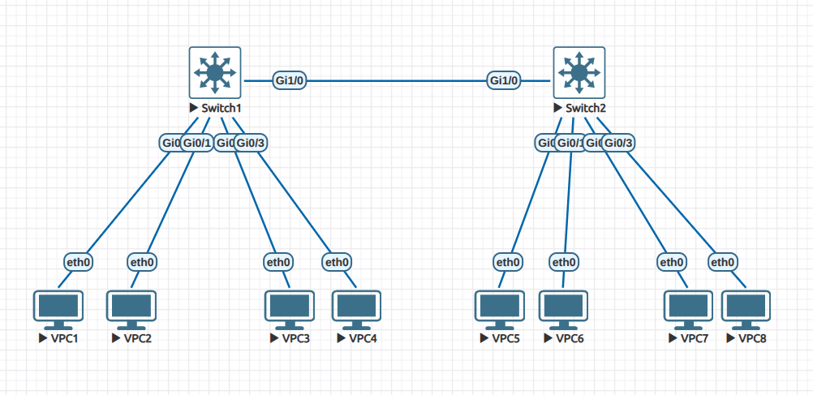
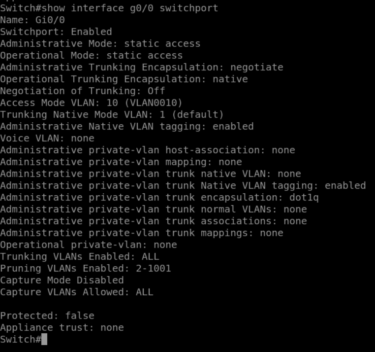
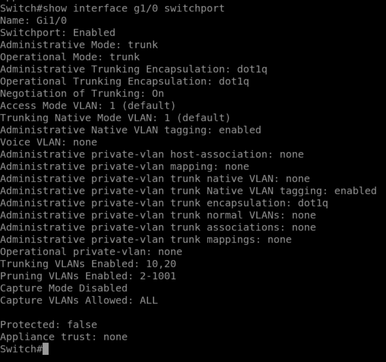
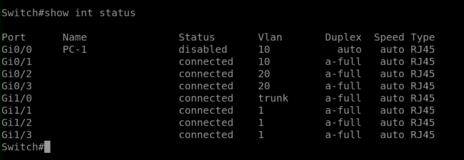

# Lab 06 - Layer 2 Diagnostics (Part 2)

## Objective

- Explore Layer 2 diagnostics commands to check interface configuration and status.  
- Verify access vs trunk interfaces, VLAN membership, and operational parameters.  
- Use CLI commands (`show interface switchport`, `show interface status`) to validate trunk and access port setup.  

## Topology

- 2 Switches (SW1, SW2)  
- 8 PCs (VPC1–VPC8)  



### VLAN Assignment

| VLAN | Subnet           | Devices (SW1)              | Devices (SW2)              |
|------|------------------|-----------------------------|-----------------------------|
| 10   | 192.168.10.0/24 | VPC1 (192.168.10.1), VPC2 (192.168.10.2) | VPC5 (192.168.10.3), VPC6 (192.168.10.4) |
| 20   | 192.168.20.0/24 | VPC3 (192.168.20.1), VPC4 (192.168.20.2) | VPC7 (192.168.20.3), VPC8 (192.168.20.4) |

- Trunk between SW1 and SW2 on `G1/0`.  
- Only VLANs 10 and 20 are allowed on the trunk.  

## Configuration Summary

```bash
vlan 10
vlan 20

interface g0/0-1
 switchport mode access
 switchport access vlan 10

interface g0/2-3
 switchport mode access
 switchport access vlan 20

interface g1/0
 switchport trunk encapsulation dot1q
 switchport mode trunk
 switchport trunk allowed vlan 10,20
```

## Verification

### Checking an Access Port
```bash
show interface g0/0 switchport
```

Shows:

Administrative mode: static access

Operational mode: static access

Access Mode VLAN: 10

✅ Confirms G0/0 is configured correctly as an access port for VLAN 10.



### Checking the Trunk Port
```bash
show interface g1/0 switchport
```

Shows:

Administrative mode: trunk

Operational mode: trunk

Encapsulation: dot1q

VLANs allowed on trunk: 10,20

✅ Confirms G1/0 is configured correctly as a trunk with restricted VLANs.



### Interface Status Overview
```bash
show interface status
```

Shows each interface with:

Description (if configured)

Status (connected/notconnect)

VLAN membership or trunk mode

Duplex and speed settings

✅ Provides a quick overview of switch port utilization.



## Lessons Learned

```bash show interface switchport``` provides detailed Layer 2 configuration for individual ports (mode, VLAN, encapsulation).

Trunk verification is essential to confirm correct VLAN tagging and allowed VLANs.

```bash show interface status``` is a powerful command for a high-level overview of all interfaces.

These diagnostics help identify VLAN misconfigurations and connectivity issues quickly.
