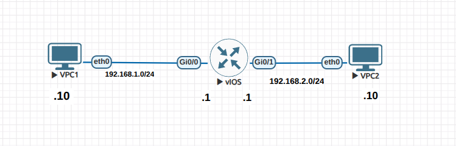
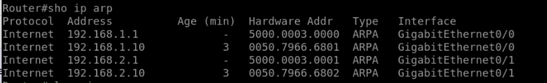
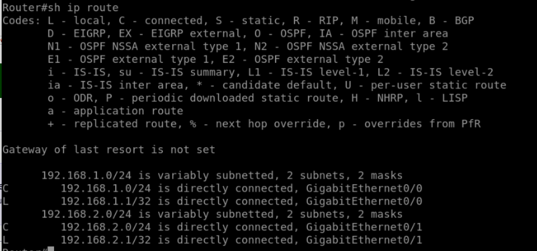

# Lab 07 - Packet Routing and ARP

## Objective

- Observe how ARP is used to resolve IP-to-MAC mappings before routing occurs.  
- Verify ARP table population on a router.  
- Understand the sequence of ARP + ICMP messages when PCs in different networks communicate.  
- Review how routing tables show directly connected networks.  

## Topology

- 1 Router (R1)  
- 2 PCs  

| Device | Interface | IP Address     | Subnet Mask   | Default Gateway |
|--------|-----------|----------------|---------------|-----------------|
| VPC1   | G0/0      | 192.168.1.10   | 255.255.255.0 | 192.168.1.1     |
| VPC2   | G0/1      | 192.168.2.10   | 255.255.255.0 | 192.168.2.1     |
| R1 G0/0 | -        | 192.168.1.1    | 255.255.255.0 | -               |
| R1 G0/1 | -        | 192.168.2.1    | 255.255.255.0 | -               |



## Configuration Summary

- Router R1 interfaces:

```bash
interface g0/0
 ip address 192.168.1.1 255.255.255.0
 no shutdown

interface g0/1
 ip address 192.168.2.1 255.255.255.0
 no shutdown
```
PCs configured with IP + default gateway.

## Verification

### Initial ARP Table

```bash
show ip arp
```
Before any traffic, the ARP table only shows the router’s own interfaces:

192.168.1.1 → MAC of G0/0

192.168.2.1 → MAC of G0/1



### Pinging from PC1 → PC2

1. PC1 sends ARP request for its default gateway (192.168.1.1):

  - Source MAC: PC1

  - Destination MAC: FF:FF:FF:FF:FF:FF (broadcast)

  - Source IP: 192.168.1.10

  - Destination IP: 192.168.1.1

2. Router R1 replies with the MAC of G0/0.

3. PC1 sends ICMP packet (ping) with:

  - Src MAC: PC1

  - Dst MAC: R1 G0/0

  - Src IP: 192.168.1.10

  - Dst IP: 192.168.2.10

4. R1 checks routing table → sees 192.168.2.0/24 is directly connected on G0/1.

5. R1 ARPs for 192.168.2.10 (PC2). PC2 replies with its MAC.

6. R1 forwards the ICMP packet to PC2 with:

  - Src MAC: R1 G0/1

  - Dst MAC: PC2

✅ PC1 can now ping PC2 successfully.

### ARP Table After Ping

```bash
show ip arp
```
- Now includes dynamic entries for:

  - 192.168.1.10 → MAC of PC1

  - 192.168.2.10 → MAC of PC2



### Routing Table

```bash
show ip route
```
- Displays two connected networks:

  - C 192.168.1.0/24 is directly connected, via G0/0

  - C 192.168.2.0/24 is directly connected, via G0/1

### Lessons Learned
- PCs use ARP to resolve the MAC of their default gateway before sending packets to other subnets.

- Routers must ARP on both ingress and egress interfaces when routing between networks.

- show ip arp is useful to check resolved IP-to-MAC mappings.

- show ip route verifies which networks are directly connected and routable.

- ARP happens at Layer 2, while routing decisions happen at Layer 3. Both are required for inter-VLAN / inter-subnet communication.


