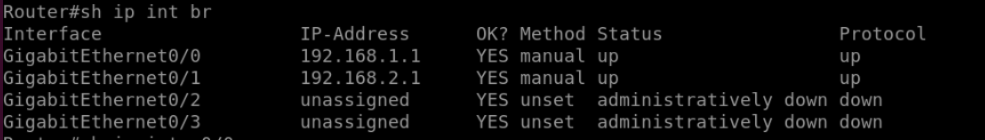

# Lab 08 - IP Address Assignment (IPv4 and IPv6)

## Objective

- Learn how to assign IPv4 and IPv6 addresses to router interfaces.  
- Understand the concept of **secondary IP addresses** in IPv4.  
- Verify IPv4/IPv6 configuration using `show` commands.  
- Recognize differences between IPv4 and IPv6 addressing flexibility.  

## Topology

- 1 Router (R1)  
- 2 Switches (SW1, SW2)  

| Device | Interface | IP (Primary)     | IP (Secondary)     | IPv6 (Primary)           | IPv6 (Additional)          |
|---------|-----------|------------------|--------------------|---------------------------|-----------------------------|
| R1      | G0/0      | 192.168.1.1/24   | 192.168.10.1/24    | 2001:db8:0:1::1/64       | 2001:db8:0:10::1/64        |
| R1      | G0/1      | 192.168.2.1/24   | 192.168.20.1/24    | 2001:db8:0:2::1/64       | 2001:db8:0:20::1/64        |


## Configuration Summary

```bash
interface g0/0
 ip address 192.168.1.1 255.255.255.0
 ip address 192.168.10.1 255.255.255.0 secondary
 ipv6 address 2001:db8:0:1::1/64
 ipv6 address 2001:db8:0:10::1/64
 no shutdown

interface g0/1
 ip address 192.168.2.1 255.255.255.0
 ip address 192.168.20.1 255.255.255.0 secondary
 ipv6 address 2001:db8:0:2::1/64
 ipv6 address 2001:db8:0:20::1/64
 no shutdown
```

💡 Note:

For IPv4, the secondary keyword is required to add an additional IP address.

Without it, the second address overwrites the first.

IPv6 does not require secondary; multiple addresses per interface are allowed by default.

## Verification
### Verify IPv4 Configuration
```bash
show run interface g0/0

```bash
show ip interface brief
```


```bash
show ip interface g0/0
```


✅ Displays both primary and secondary IPv4 addresses.

### Verify IPv6 Configuration
```bash
show run interface g0/0
```


```bash
show ipv6 interface brief
```


```bash
show ipv6 interface g0/0
```


✅ Shows all configured IPv6 addresses on the interface.

### Compare Primary vs. Secondary Behavior
- IPv4 secondary IPs allow multiple subnets to share the same physical interface.

- Routing updates and ARP entries will exist for each subnet.

- IPv6 simplifies this by natively supporting multiple prefixes on the same interface.

## Lessons Learned
- IPv4 interfaces can have one primary and multiple secondary addresses (using secondary).

- IPv6 interfaces can have multiple addresses without special keywords.

- show ip interface brief and show ipv6 interface brief are quick ways to validate configuration.

- Secondary addresses are useful for migrations or connecting overlapping subnets without adding more interfaces.

- Always ensure subnets assigned to the same interface do not overlap.
