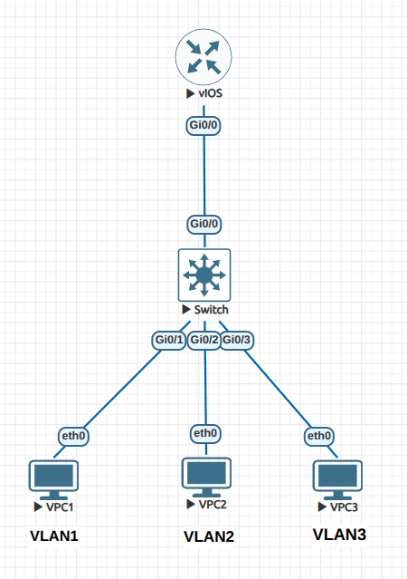
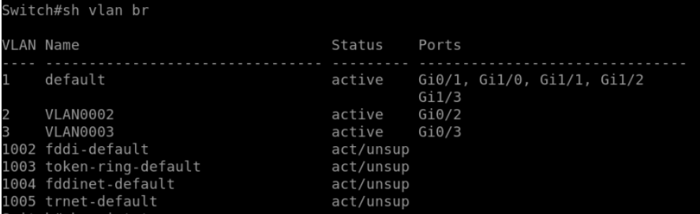
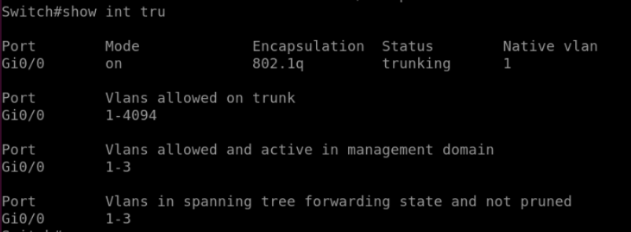
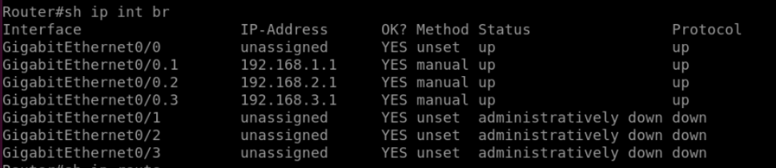
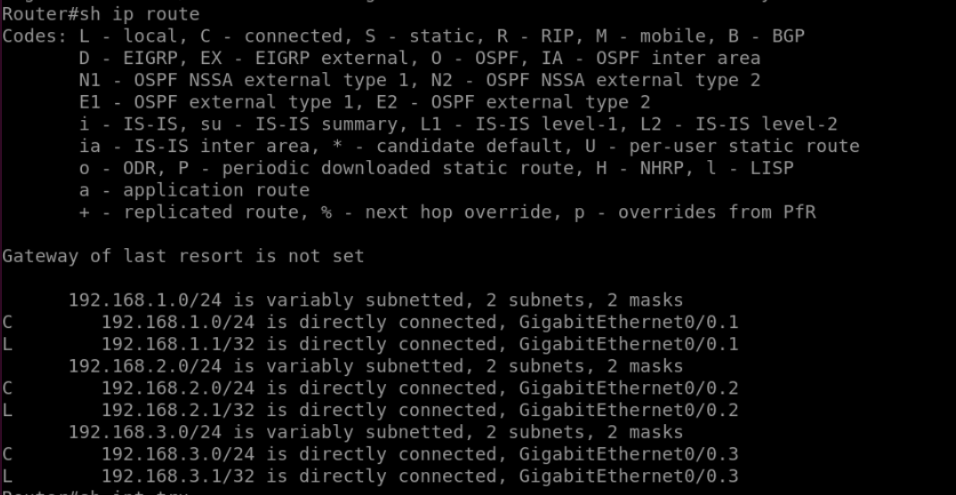

# Lab 09 - Router-on-a-Stick (Inter-VLAN Routing)

## Objective

- Understand the concept of **Router-on-a-Stick (ROAS)** for inter-VLAN routing.  
- Configure a single router interface to route traffic between multiple VLANs using subinterfaces.  
- Verify inter-VLAN communication.  
- Recognize why ROAS can become a bottleneck in large networks.

## Topology

- 1 Router (R1)  
- 1 Switch (SW1)  
- 3 PCs  

| Device | Interface | VLAN | IP Address     | Subnet Mask   |
|--------|-----------|------|----------------|---------------|
| VPC1   | G0/1      | 1    | 192.168.1.1    | 255.255.255.0 |
| VPC2   | G0/2      | 2    | 192.168.2.1    | 255.255.255.0 |
| VPC3   | G0/3      | 3    | 192.168.3.1    | 255.255.255.0 |
| R1 G0/0.1 | -      | 1    | 192.168.1.254  | 255.255.255.0 |
| R1 G0/0.2 | -      | 2    | 192.168.2.254  | 255.255.255.0 |
| R1 G0/0.3 | -      | 3    | 192.168.3.254  | 255.255.255.0 |



## Configuration Summary

### Switch Configuration

**Create VLANs**

```bash
vlan 1
vlan 2
vlan 3
```

Verify VLANs
```bash
show vlan brief
```

Assign Interfaces to VLANs

interface g0/1
```bash
 switchport mode access
 switchport access vlan 1
```
interface g0/2
 ```bash
 switchport mode access
 switchport access vlan 2
```

interface g0/3
```bash
 switchport mode access
 switchport access vlan 3
```

Verify
```bash
show vlan brief
```


Configure Trunk Link to Router

interface g0/0
 ```bash
 switchport trunk encapsulation dot1q
 switchport mode trunk
```

Verify
```bash
show interfaces trunk
```


Router Configuration
```bash
interface g0/0
  no shutdown

interface g0/0.1
 encapsulation dot1q 1
 ip address 192.168.1.254 255.255.255.0

interface g0/0.2
 encapsulation dot1q 2
 ip address 192.168.2.254 255.255.255.0

interface g0/0.3
 encapsulation dot1q 3
 ip address 192.168.3.254 255.255.255.0
```

Verify
```bash
show ip interface brief
```


Check Routing Table
```bash
show ip route
```


Displays three directly connected networks (VLANs 1, 2, and 3).


## Verification

### Ping Tests

- From PC1 → PC2 ✅ Successful

- From PC1 → PC3 ✅ Successful

- Inter-VLAN communication works via router subinterfaces.

### Routing Verification
```bash
show ip route
```
- Confirms router has directly connected routes for all VLAN subnets.

- Traffic between VLANs is routed through R1.

## Lessons Learned

- Router-on-a-Stick enables inter-VLAN routing using one physical interface with multiple subinterfaces.

- Each VLAN is identified using encapsulation dot1q VLAN_ID.

- All VLAN traffic passes through the router, potentially creating a bottleneck.

- Larger or high-throughput networks use Layer 3 switches for faster inter-VLAN routing.

