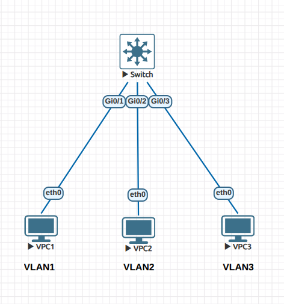
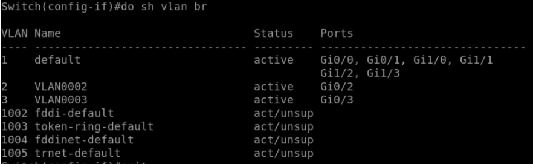
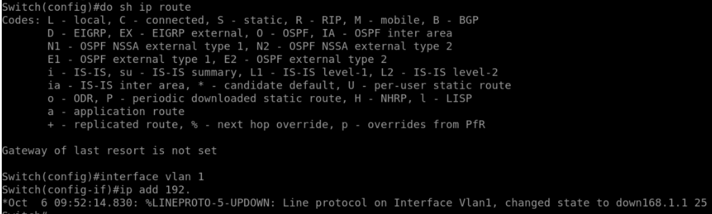
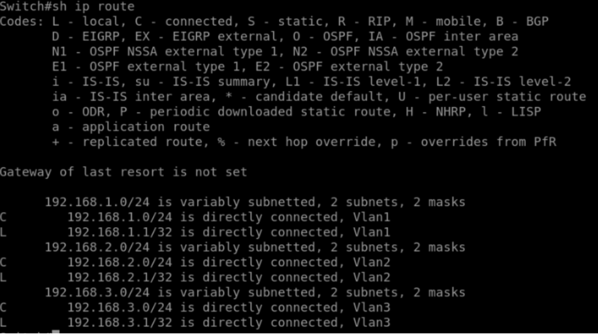
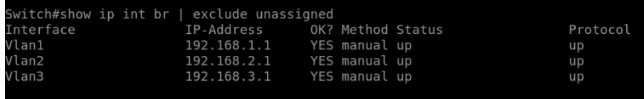
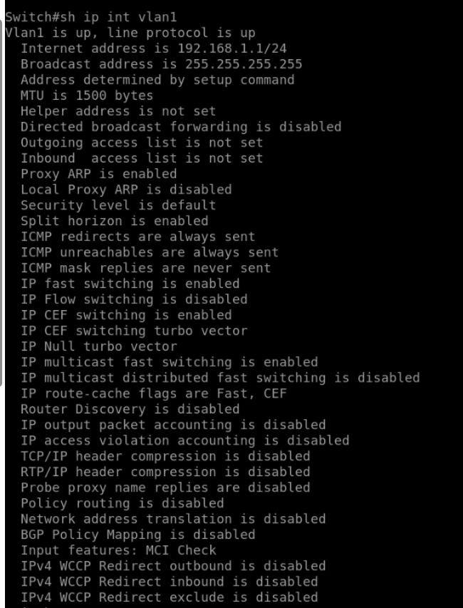
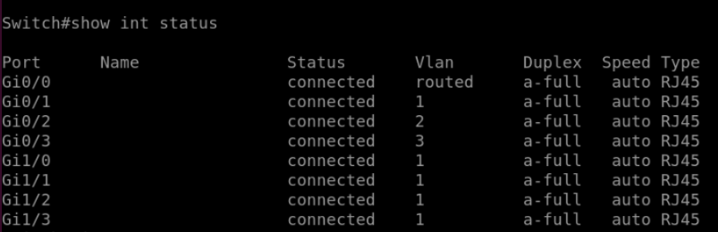
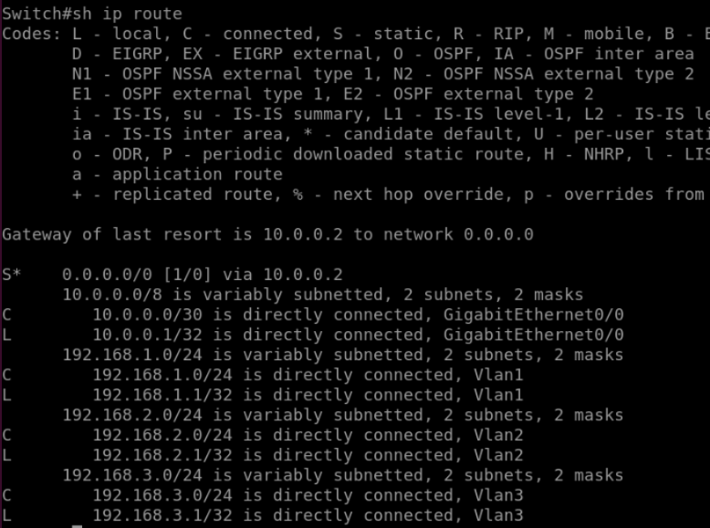

# Lab 10 - Inter-VLAN Routing with a Multilayer Switch

## Objective

- Understand how multilayer switches (MLS) can perform routing between VLANs without requiring an external router.  
- Learn how to configure Switched Virtual Interfaces (SVIs) for inter-VLAN routing.  
- Explore the concept of routed switch ports for Layer 3 connectivity to external networks.  

## Topology

- 1 Multilayer Switch (MLS)  
- 1 Router (R1)  
- 3 PCs  

| Device | Interface | VLAN | IP Address     | Subnet Mask   | Default Gateway |
|---------|-----------|------|----------------|---------------|-----------------|
| VPC1    | G0/1      | 1    | 192.168.1.10   | 255.255.255.0 | 192.168.1.1     |
| VPC2    | G0/2      | 2    | 192.168.2.10   | 255.255.255.0 | 192.168.2.1     |
| VPC3    | G0/3      | 3    | 192.168.3.10   | 255.255.255.0 | 192.168.3.1     |
| R1      | G0/0      | -    | 10.0.0.2       | 255.255.255.252 | -             |
| MLS     | G0/0      | -    | 10.0.0.1       | 255.255.255.252 | -             |



## Configuration Summary

### VLAN Creation

```bash
vlan 1
vlan 2
vlan 3
```

### VLAN Interface Assignment
```bash 
interface g0/1
 switchport mode access
 switchport access vlan 1

interface g0/2
 switchport mode access
 switchport access vlan 2

interface g0/3
 switchport mode access
 switchport access vlan 3
```

✅ Verification
```bash
show vlan brief
```


### Enabling IP Routing
Initially, the switch cannot route between VLANs.

To enable inter-VLAN routing:

```bash
ip routing
```

```bash
show ip route
```



Shows no connected networks

### Configure Switched Virtual Interfaces (SVIs)
```bash
interface vlan 1
 ip address 192.168.1.1 255.255.255.0
 no shutdown

interface vlan 2
 ip address 192.168.2.1 255.255.255.0
 no shutdown

interface vlan 3
 ip address 192.168.3.1 255.255.255.0
 no shutdown
```

✅ Verification

```bash
show ip route
```


Shows 3 connected VLAN networks (192.168.1.0/24, 192.168.2.0/24, 192.168.3.0/24).

```bash
show ip interface brief | exclude unassigned
```


To view details of a specific VLAN interface:
```bash
show ip interface vlan 1
```


✅ After configuring SVIs, PC1 can successfully ping PC2 and PC3, confirming inter-VLAN routing is working internally within the MLS.

## Configuring a Routed Switch Port (for External Router Connection)
Some traffic (e.g., internet-bound) must leave the switch — we convert an interface to Layer 3 mode.

```bash
interface g0/0
 no switchport
 ip address 10.0.0.1 255.255.255.252
 no shutdown
```

The command "no switchport" disables layer 2 switching and converts the interface to a layer 3 routed interface


✅ Verification

```bash
show interface g0/0 switchport
```

Shows: Switchport: Disabled


```bash
show interface status
```
Shows G0/0 as a routed port.


### Router Configuration

```bash
interface g0/0
 ip address 10.0.0.2 255.255.255.252
 no shutdown
```
### Static Route on the Switch
Add a default route to direct unknown traffic to the router.

```bash
ip route 0.0.0.0 0.0.0.0 10.0.0.2
```
✅ Verification

```bash
show ip route
```


Now displays:

- Connected VLAN networks

- Connected 10.0.0.0/30 network

- Static default route via 10.0.0.2


✅ After adding the static route, the switch can successfully ping 10.0.0.2 (the router interface), confirming connectivity to the external network.

## Lessons Learned
- Multilayer switches perform both Layer 2 switching and Layer 3 routing.

- SVIs enable inter-VLAN routing internally, removing the need for an external router-on-a-stick.

- The ip routing command activates Layer 3 functionality on the switch.

- Routed switch ports allow direct Layer 3 connections to routers or other networks.

- Static routes define default gateways for traffic leaving the local VLANs.

- Inter-VLAN routing on MLS is more scalable and efficient than router-on-a-stick, reducing bottlenecks and improving performance.
